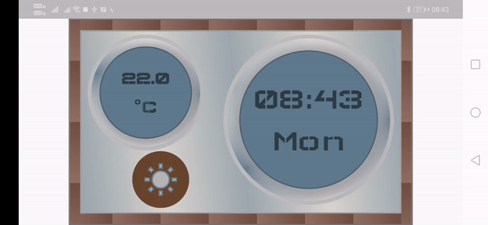

#FlutterClock

# vintage_clock

Author Name: Mayuri Ruparel Author Email: mayuri2411@gmail.com

Vintage Clock Application developed in Flutter for Flutter Clock Contest.

Good old vintage Wooden clock developed with Flutter with Weather showing Flare animated Pendulum. 

There are no Images used in this Application.

# For Clock Pendulum:

Flare Animations: https://rive.app/

Material Design Icons: https://material.io/resources/icons/

Feather Icons - Open Source Icons - for Windy: https://feathericons.com/

# Run Configurations

Have to run flutter packages get command to get flare_flutter dependency.
Other then that, there is no special configuration required to run this App. 

# Devices Tested

Tested in Honor Play Android Phone, Android Samsung Tablet, iPhone 7 and iPad 

# Git Repository

https://github.com/mayuriruparel/vintage_clock

